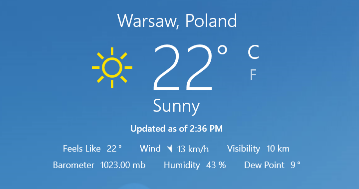

# Programowanie Obiektowe

### Zadanie laboratoryjne nr 2

Celem zadania jest stworzenie gadżetu wyświetlającego aktualne dane pogodowe (oraz informacje o jakości powietrza) dla Warszawy, uproszczonej wersji aplikacji Weather dostępnej w systemie Windows:

Aplikacja powinna opierać się na danych pobieranych w ustalonych odstępach czasu (np. co 5 minut) lub na żądanie użytkownika (np. w reakcji na naciśnięcie przycisku powodującego odświeżenie danych), z kilku ogólnodostępnych w Internecie źródeł:

1.  [http://openweathermap.org/](https://www.google.com/url?q=http://openweathermap.org/&sa=D&ust=1520594210628000&usg=AFQjCNHASDyse4oIiD_RSfZUAvNRjIiyiQ)\- dane w formacie JSON dostępne przez API REST ([http://openweathermap.org/current](https://www.google.com/url?q=http://openweathermap.org/current&sa=D&ust=1520594210628000&usg=AFQjCNHQtBdXhlmO-HAJw-qAEIyGpo0HtA))
2.  [http://www.meteo.waw.pl/](https://www.google.com/url?q=http://www.meteo.waw.pl/&sa=D&ust=1520594210628000&usg=AFQjCNGvgl1Ywm3DinGuZ6-U_JWRjK1klQ)\- brak API REST, potrzebne dane można wyekstrahować ze strony HTML
3.  [http://powietrze.gios.gov.pl/pjp/current](https://www.google.com/url?q=http://powietrze.gios.gov.pl/pjp/current&sa=D&ust=1520594210629000&usg=AFQjCNGkeVPXPV0XnCqVDcR6lDirxAhNNw)\- API REST dostępne pod adresem [http://powietrze.gios.gov.pl/pjp/current/getAQIDetailsList?param=AQI](https://www.google.com/url?q=http://powietrze.gios.gov.pl/pjp/current/getAQIDetailsList?param%3DAQI&sa=D&ust=1520594210629000&usg=AFQjCNGR5IaKshPCWvC8a4-2wnvCnu3IvQ)

Użytkownik powinien mieć możliwość wyboru z poziomu interfejsu aplikacji źródła (1. albo 2.), z którego dane chce w danym momencie oglądać (tzn. aplikacja powinna umożliwiać przełączanie interfejsu użytkownika między oboma źródłami). Informacje o jakości powietrza (źródło 3.) powinny być widoczne w aplikacji przez cały czas. Zakres parametrów prezentowanych użytkownikowi powinien obejmować:

*   temperaturę (w skali Celsjusza),
*   ciśnienie,
*   zachmurzenie,
*   siłę i kierunek wiatru,
*   wilgotność,
*   poziom pyłów PM 2.5 i PM 10.

W przypadku, gdy dane źródło nie udostępnia danych o jednym z tych parametrów aplikacja może wyświetlać informację o braku danych (np. znak “-” w polu ciśnienie zachmurzeniedla źródła 2.). Dodatkowo użytkownik powinien mieć dostęp do informacji o tym, kiedy zostały pobrane dane, które są mu prezentowane (por. rysunek powyżej).

Interfejs graficzny aplikacji powinien być stworzony przy użyciu platformy JavaFX ([http://docs.oracle.com/javase/8/javase-clienttechnologies.htm](https://www.google.com/url?q=http://docs.oracle.com/javase/8/javase-clienttechnologies.htm&sa=D&ust=1520594210630000&usg=AFQjCNGCWQxs3zfVJZJJQo4iiJx32VMAfw)). Decyzje dotyczące wyglądu aplikacji (układ, typ użytych kontrolek, styl) oraz architektury (podział na konkretne klasy, powiązania między nimi, sygnatury metod, etc.) pozostawione są w całości do podjęcia autorowi programu. Zachęcamy (choć nie jest to bezwzględnie wymagane) do napisania aplikacji w stylu reaktywnym[\[1\]](#ftnt1) ([http://reactivex.io](https://www.google.com/url?q=http://reactivex.io&sa=D&ust=1520594210630000&usg=AFQjCNEwyo37HFVOdv0MEKT-ZPcio9o7vg)), przy użyciu biblioteki RxJava ([https://github.com/ReactiveX/RxJava](https://www.google.com/url?q=https://github.com/ReactiveX/RxJava&sa=D&ust=1520594210631000&usg=AFQjCNGyKMFqD7rcTr3MZ3EU-7hz6ceDXA)) lub RxScala (dla potoku Scalowego; [https://github.com/ReactiveX/RxScala](https://www.google.com/url?q=https://github.com/ReactiveX/RxScala&sa=D&ust=1520594210631000&usg=AFQjCNHrIAmNU6xiEixj6Jg9EZn4arcaBQ)). Świetny wstęp do programowania reaktywnego można znaleźć pod adresem:  
[https://thomasnield.gitbooks.io/rxjavafx-guide/content/](https://www.google.com/url?q=https://thomasnield.gitbooks.io/rxjavafx-guide/content/&sa=D&ust=1520594210631000&usg=AFQjCNEgKizOmvMvF9QoD9Rt0xHFMvQ3yg)

Aplikacja powinna zapewniać podstawową obsługę błędów, np. w przypadku, gdy dane nie mogą być pobrane ze źródła (z powodu tymczasowego braku połączenia) aplikacja może zgłosić taki problem użytkownikowi i kontynuować działanie.

Z uwagi na fakt, że z niektórymi technologiami (JavaFX, programowanie reaktywne, klient usługi REST) mogliście Państwo nie mieć dotychczas styczności, udostępniamy Państwu przykładową aplikację demonstrującą zastosowanie tych narzędzi:

[https://www.mimuw.edu.pl/~kdr/xchange/XchangeApp-1.0.2.zip](https://www.google.com/url?q=https://www.mimuw.edu.pl/~kdr/xchange/XchangeApp-1.0.2.zip&sa=D&ust=1520594210631000&usg=AFQjCNEQtlQ5dm5mtIsh83S7N28KriXkRg)

Program ten służy do prezentowania kursów walut (dolar, euro, bitcoin) oraz złota, które pobiera z serwisów NBP oraz strony [http://bitcoin.pl](https://www.google.com/url?q=http://bitcoin.pl&sa=D&ust=1520594210632000&usg=AFQjCNGqA428RRE2FFdAlVaI6jXp9upeGw). Aplikacja posiada interfejs stworzony w JavieFX i jest napisana w stylu reaktywnym. Możecie Państwo w dowolnie zmodyfikować udostępniony kod i zaadaptować go do swoich potrzeb (oczywiście wzorowanie się na tej aplikacji nie jest obligatoryjne). Więcej szczegółowych uwag dotyczących tej aplikacji zamieszczonych jest poniżej.

Pytania dotyczące specyfikacji oraz działania dostarczonego programu można kierować do jego autora na adres [kdr@mimuw.edu.pl](mailto:kdr@mimuw.edu.pl).

Termin nadsyłania rozwiązań upływa dnia 10 czerwca.  

* * *

Changelog
=========

\[30.05.2017\] Aktualizacja przykładowej aplikacji: poprawione zależności w konfiguracji Mavena - projekt powinien budować się poprawnie pod Mavenem, poprawienie jakości renderingu czcionek (w tym: ikon Font Awesome) na niektórych konfiguracjach.

\[31.05.2017\] Dodanie informacji o sposobie budowania przykładowej aplikacji i jej zależnościach.

\[05.06.2017\] Aktualizacja przykładowej aplikacji: dodany panel z ustawieniami (możliwość regulacji częstotliwości automatycznego odświeżania danych) oraz niespodzianka dla zainteresowanych :)

\[09.06.2017\] Dodanie informacji o możliwości użycia ikon z zestawu FontAwesome i WeatherIcons

Napisałem długi list, ponieważ nie miałem czasu uczynić go krótszym

Blaise Pascal

Uwagi do aplikacji przykładowej
===============================

Aplikacja wymaga do poprawnej kompilacji JDK 8. Na maszynie students stosowne środowisko można znaleźć w katalogu /usr/java/jdk1.8.0_73, przy czym nie jest to domyślne JDK - aby skutecznie przełączyć się na JDK 8 można ustawić (zmodyfikować) zmienne środowiskowe JAVA_HOME (na podaną wyżej ścieżkę do katalogu z JDK) oraz PATH (na katalog bin w katalogu z JDK). Aplikacja wymaga do uruchomienia JRE (zawierającego się w JDK) w wersji co najmniej 8u60.

Do projektu z kodem aplikacji dołączony jest plik konfiguracyjny Maven (jest to plik o nazwie pom.xml w głównym katalogu projektu). Maven ułatwia zarządzanie zależnościami projektu i umożliwia automatyzację m.in. procesu budowania i uruchamiania aplikacji. Na maszynie students projekt można zbudować wywołując

export JAVA\_HOME=/usr/java/jdk1.8.0\_73

mvn clean compile

z poziomu głównego katalogu projektu (z plikiem pom.xml), a następnie (jeśli w wydruku nie ma komunikatu o straszliwym błędzie) uruchomić aplikację

mvn exec:java

Popularne środowiska deweloperskie potrafią importować istniejące projekty Maven:

*   instrukcja wideo dla Eclipse:[https://www.youtube.com/watch?v=BlkgrXb3L0c](https://www.google.com/url?q=https://www.youtube.com/watch?v%3DBlkgrXb3L0c&sa=D&ust=1520594210635000&usg=AFQjCNEh-ugPEDe1H6Sus5wZXCCkksjzCg)
*   instrukcja dla Intellij:[https://www.jetbrains.com/help/idea/2017.1/importing-project-from-maven-model.html](https://www.google.com/url?q=https://www.jetbrains.com/help/idea/2017.1/importing-project-from-maven-model.html&sa=D&ust=1520594210635000&usg=AFQjCNFSielI7xymrnV7imjqBo2n1I8_QQ)

        Rzecz jasna - do zbudowania projektu w IDE potrzebne jest również JDK 8.

        Po wykonaniu tych kroków nie powinno być konieczne ręczne dodawanie jakichkolwiek zależności (bibliotek) do projektu.

W razie wystąpienia problemów ze zbudowaniem projektu proszę o informację mailową.

Projekt korzysta z kilku zewnętrznych bibliotek - poniżej zostaną one krótko opisane:

*   Netty ([https://github.com/netty/netty](https://www.google.com/url?q=https://github.com/netty/netty&sa=D&ust=1520594210636000&usg=AFQjCNFRbaHrm4Lj7xTWllJPeAXE_-R89A)) \- zapewnia (międy innymi, korzystamy tylko z niewielkiego wycinka możliwości, które oferuje) implementację klienta HTTP
*   RxNetty ([https://github.com/ReactiveX/RxNetty](https://www.google.com/url?q=https://github.com/ReactiveX/RxNetty&sa=D&ust=1520594210636000&usg=AFQjCNF89lcZ7iwQfH3F95IPIYRLzcbrFQ)) \- reaktywne “opakowanie” dla biblioteki Netty
*   RxJava ([https://github.com/ReactiveX/RxJava](https://www.google.com/url?q=https://github.com/ReactiveX/RxJava&sa=D&ust=1520594210636000&usg=AFQjCNGFefhNqkne94MTtF6sr3Tp5nxQ4Q)) \- biblioteka do programowania reaktywnego dla Javy (istotną uwagą może być tutaj wspomnienie, że aplikacja używa wersji tej biblioteki z gałęzi 1.x)
*   RxJavaFx ([https://github.com/ReactiveX/RxJavaFX](https://www.google.com/url?q=https://github.com/ReactiveX/RxJavaFX&sa=D&ust=1520594210637000&usg=AFQjCNEFPYaKGQszEFIEWtCzWQiWitWhpQ)) \- pomost między bibliotekami JavaFX oraz i RxJava, oferujący kilka użytecznych metod przekształcających zdarzenia (i procedury obsługi zdarzeń) na język strumieni reaktywnych
*   Ikonli ([https://github.com/aalmiray/ikonli](https://www.google.com/url?q=https://github.com/aalmiray/ikonli&sa=D&ust=1520594210637000&usg=AFQjCNG0L6ug7loLaBoxYFvrlj68ud7AZg)) \- “icon pack”, adaptacja popularnych zestawów ikon m.in. znakomitego Font Awesome ([http://fontawesome.io/](https://www.google.com/url?q=http://fontawesome.io/&sa=D&ust=1520594210637000&usg=AFQjCNGKqnu3ml4a0HsYsYbI_4sRC0Pvwg)) oraz, co może okazać się dla Państwa przydatne, Weather Icons ([https://erikflowers.github.io/weather-icons/](https://www.google.com/url?q=https://erikflowers.github.io/weather-icons/&sa=D&ust=1520594210637000&usg=AFQjCNGAffHpvu93UlbFyoHReiagQ_YU1Q))
*   JFoenix ([https://github.com/jfoenixadmin/JFoenix](https://www.google.com/url?q=https://github.com/jfoenixadmin/JFoenix&sa=D&ust=1520594210638000&usg=AFQjCNG4BZU_0OEcMJyRW7AT4NEvI-E3vA)) \- zestaw kontrolek utrzymanych w stylistyce material design ([https://material.io/](https://www.google.com/url?q=https://material.io/&sa=D&ust=1520594210638000&usg=AFQjCNGRfJbPWXE-tBgSiR-w6nU8ga4pfg)) dla JavyFX
*   GSON ([https://github.com/google/gson](https://www.google.com/url?q=https://github.com/google/gson&sa=D&ust=1520594210638000&usg=AFQjCNGDe-vRc1naPPIhTPjKkgYKFC3x4w)) \- parser JSON
*   Log4j ([https://logging.apache.org/log4j](https://www.google.com/url?q=https://logging.apache.org/log4j&sa=D&ust=1520594210639000&usg=AFQjCNH7KkAtgfmSQc_InL6ROCVhmFcX0Q)) \- obsługa komunikatów diagnostycznych logowanych na konsolę/do pliku
*   lombok ([https://projectlombok.org/](https://www.google.com/url?q=https://projectlombok.org/&sa=D&ust=1520594210639000&usg=AFQjCNE7bcN5c-UiL7YuuTW-Yzcw_8jGKg))

Szczegółowe zapoznanie się z API powyższych bibliotek nie powinno być konieczne - do zaimplementowania wymaganej w zadaniu aplikacji wystarczy ich użycie w takim zakresie, jak podano w przykładzie. Jedynie w przypadku biblioteki RxJava zalecana jest lektura wskazanego wcześniej podręcznika.

W aplikacji możecie Państwo skorzystać m.in. z ikon (są to tak naprawdę glify czcionek, ale nie jest to tutaj istotne) z zestawu FontAwesome oraz WeatherIcons ([https://erikflowers.github.io/weather-icons/](https://www.google.com/url?q=https://erikflowers.github.io/weather-icons/&sa=D&ust=1520594210639000&usg=AFQjCNF1cWv_lMpScO6sec0MarTCji8vug)), zebranych w bibliotece Ikonli. Sposób użycia biblioteki w aplikacji JavyFX opisany jest na stronie projektu [http://aalmiray.github.io/ikonli/](https://www.google.com/url?q=http://aalmiray.github.io/ikonli/&sa=D&ust=1520594210640000&usg=AFQjCNHOCV94DH1cyur4C75uNfqYur5Wog), ale można również wzorować się na aplikacji XChangeApp, tzn. odnaleźć w źródłach odwołanie (w plikach .fxml bądź .java) do klasy FontIcon i zastąpić nazwę użytej ikony przez identyfikator wybrany ze zbioru

[http://aalmiray.github.io/ikonli/cheat-sheet-fontawesome.html](https://www.google.com/url?q=http://aalmiray.github.io/ikonli/cheat-sheet-fontawesome.html&sa=D&ust=1520594210640000&usg=AFQjCNFIcipgg6me_ZI1LhSx5N6VBf6oTg)

lub

[http://aalmiray.github.io/ikonli/cheat-sheet-weathericons.html](https://www.google.com/url?q=http://aalmiray.github.io/ikonli/cheat-sheet-weathericons.html&sa=D&ust=1520594210640000&usg=AFQjCNED2EWtBE9TCTHeH4hBGDO9b-IqZw).

* * *

[\[1\]](#ftnt_ref1)Podejście reaktywne, w ocenie autora zadania, pomaga w pisaniu bardziej zwartego, eleganckiego kodu i utrzymywania jego niskiej zależności (ang. loose coupling). Może się ono okazać szczególnie użyteczne w przypadku aplikacji z interfejsem użytkownika, gdzie zdarzeniaoraz procedury obsługi zdarzeń odgrywają pierwszoplanową rolę.
